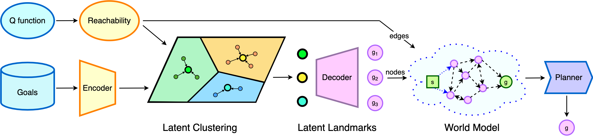

# World Model as a Graph

This is the code accompanying the paper: **World Model as a Graph: 
Learning Latent Landmarks for Planning** (ICML 2021). 

By [Lunjun Zhang](http://www.cs.toronto.edu/~lunjun/), [Ge Yang](https://scholar.google.com/citations?user=vaQcF6kAAAAJ), 
[Bradly Stadie](https://bstadie.github.io/).

A link to our paper can be found on [arXiv](https://arxiv.org/abs/2011.12491).

Videos / blog can be found on our [website](https://sites.google.com/view/latent-landmarks/).

## Overview



## Instructions

See the `scripts` folder. 

- [ ] To be updated.

## Citations

Please cite our paper as:

```
@article{zhang2020worldmodel,
  title={World Model as a Graph: Learning Latent Landmarks for Planning},
  author={Zhang, Lunjun and Yang, Ge and Stadie, Bradly},
  journal={arXiv preprint arXiv:2011.12491},
  year={2020}
}
```
